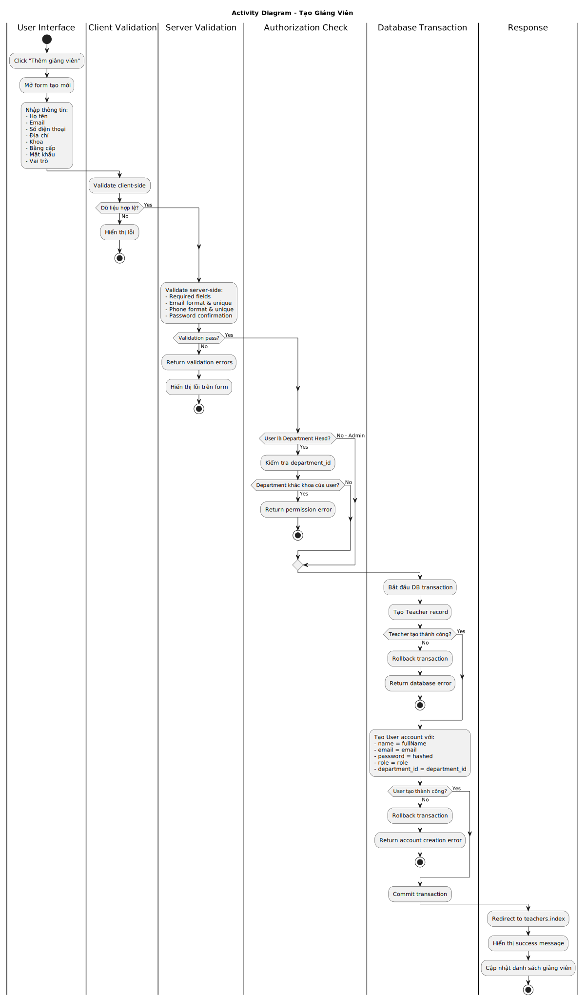
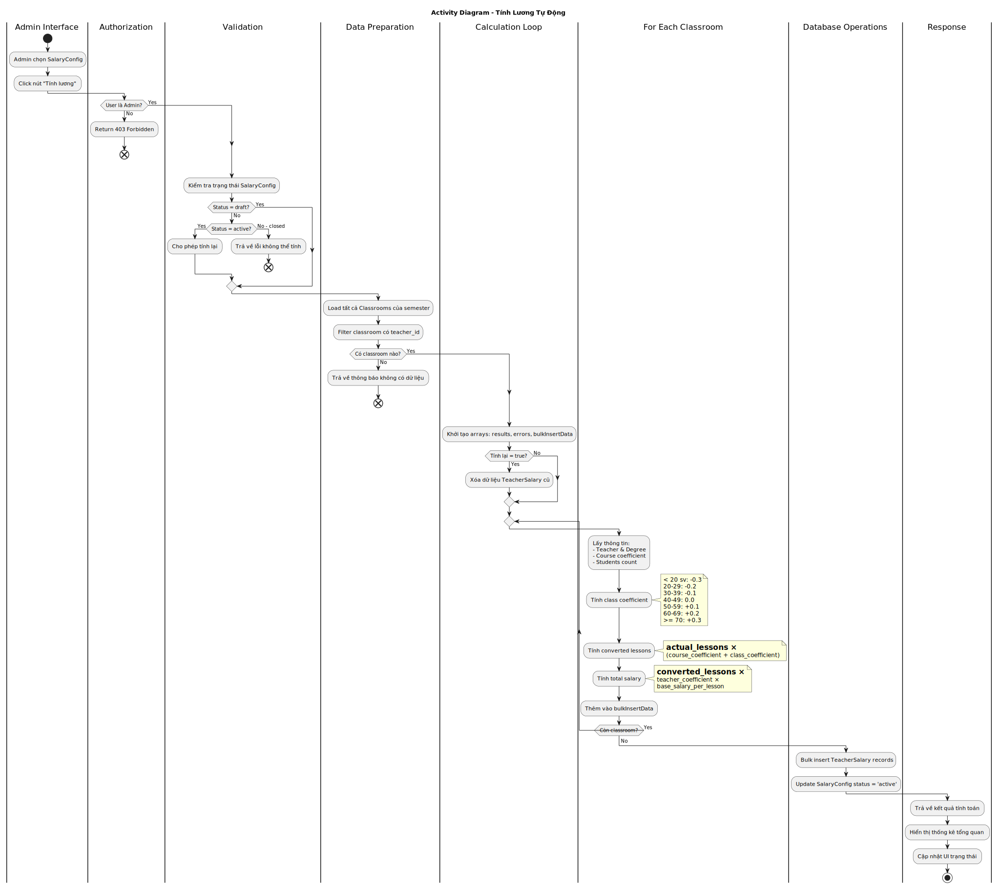
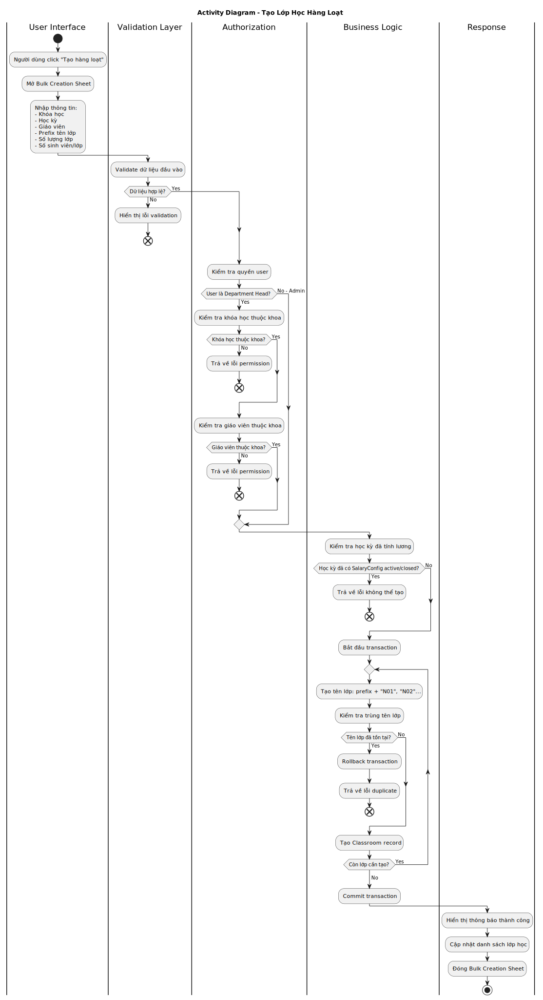
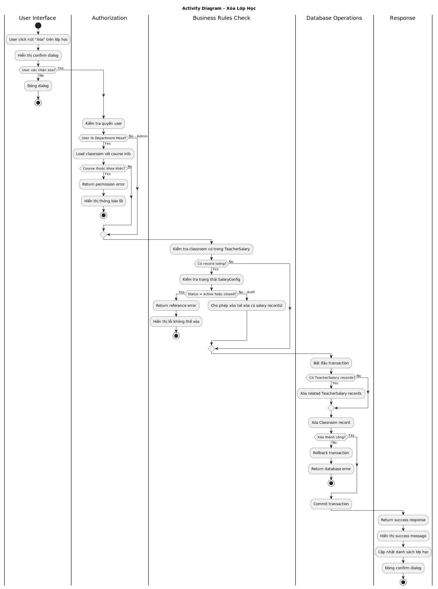
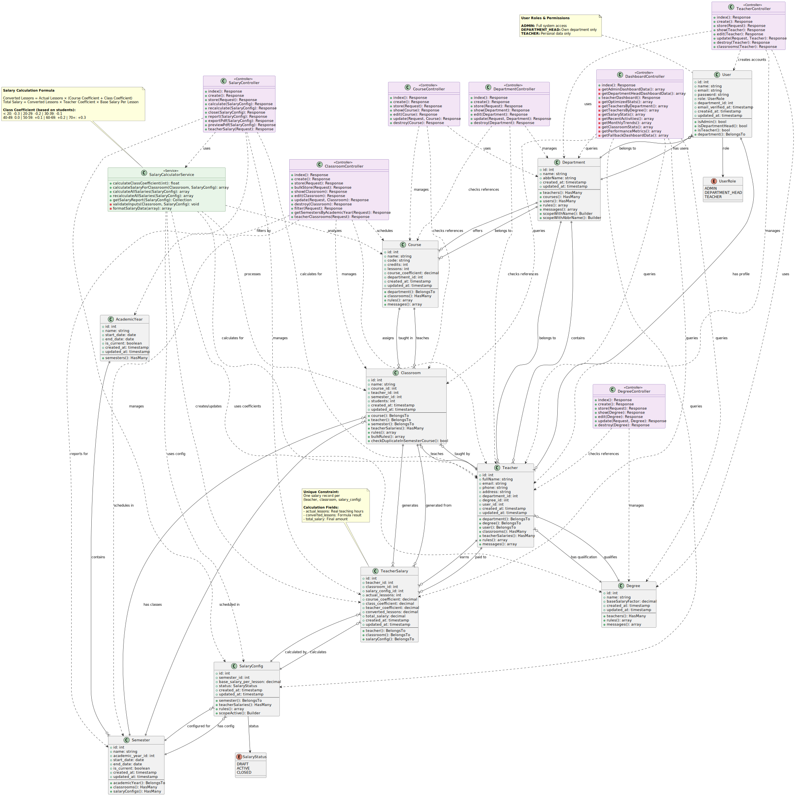
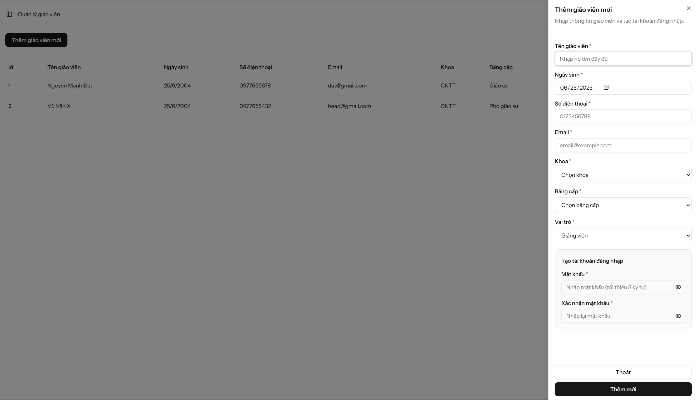
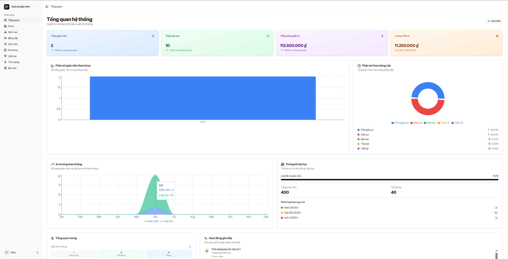
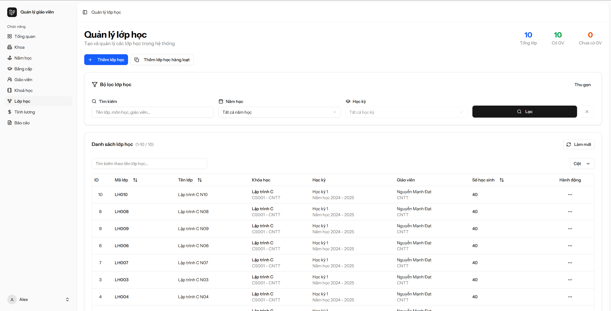
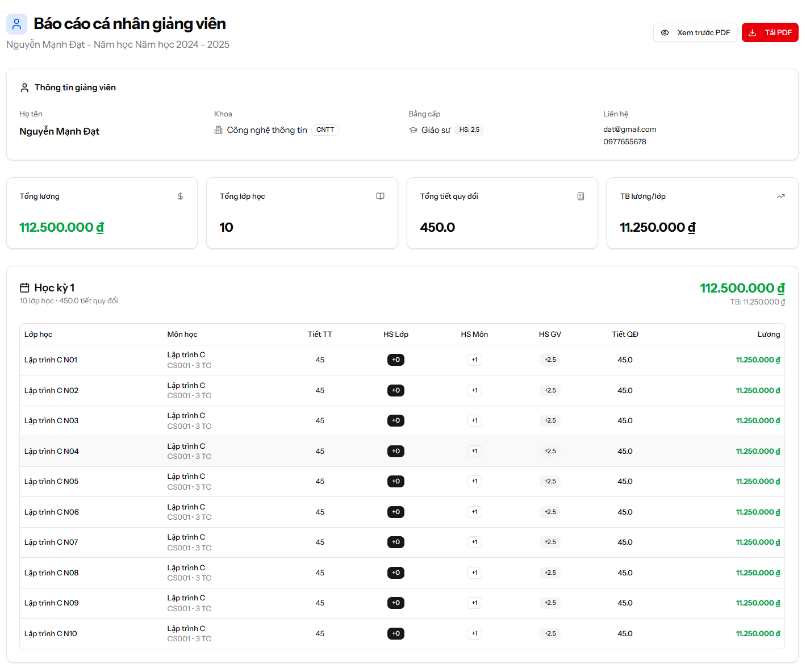
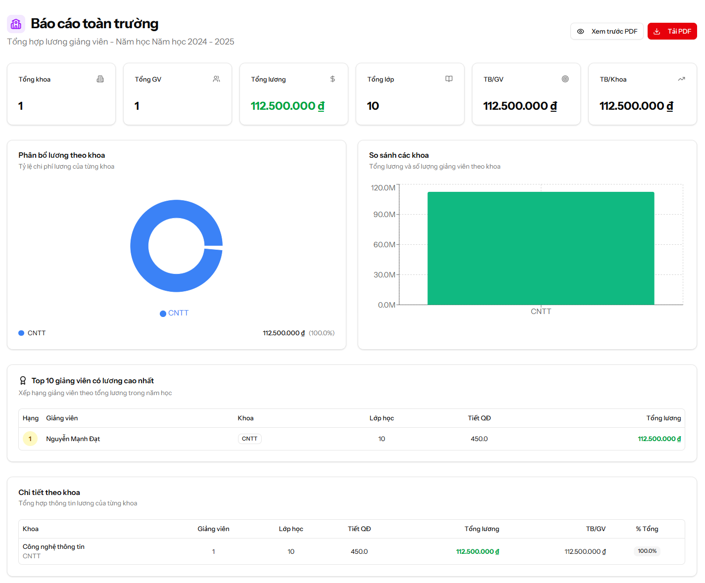

# Teacher Management System

**Hệ thống quản lý giảng viên và tính lương**

## 👥 Thành viên của nhóm

- **Nguyễn Mạnh Đạt - 22010220**

---

## 📋 Giới thiệu

Hệ thống quản lý giảng viên là một ứng dụng web được xây dựng để hỗ trợ quản lý thông tin giảng viên, lớp học và tính toán lương giảng dạy một cách tự động và chính xác.

### Website

https://msa.codes

- **Hosting**: Heroku
- **Database**: Mysql (Aiven)


### ✨ Tính năng chính

- 🏫 **Quản lý khoa**: Tạo, sửa, xóa thông tin các khoa
- 🎓 **Quản lý bằng cấp**: Quản lý các loại bằng cấp với hệ số lương
- 👨‍🏫 **Quản lý giảng viên**: Thêm, sửa, xóa thông tin giảng viên
- 📚 **Quản lý môn học**: Quản lý danh sách môn học với hệ số môn học
- 🏛️ **Quản lý năm học**: Tạo và quản lý các năm học
- 📅 **Quản lý học kỳ**: Tạo và quản lý học kỳ theo năm học
- 🎯 **Quản lý lớp học**: Tạo lớp học đơn lẻ hoặc hàng loạt
- 💰 **Tính lương giảng viên**: Tự động tính lương dựa trên các hệ số
- 📊 **Báo cáo lương**: Xem và xuất báo cáo lương dạng PDF
- 🔐 **Phân quyền**: *Admin*, *Giáo viên* và *Trưởng khoa* với quyền hạn khác nhau

---

## 📊 Database Schema

### Bảng chính
- `departments` - Khoa
- `degrees` - Bằng cấp
- `teachers` - Giảng viên
- `academic_years` - Năm học
- `semesters` - Học kỳ
- `courses` - Môn học
- `classrooms` - Lớp học
- `salary_configs` - Cấu hình lương
- `teacher_salaries` - Lương giảng viên

### Relationships
```
departments -> teachers
degrees -> teachers
academic_years -> semesters
semesters -> classrooms
courses -> classrooms
teachers -> classrooms
salary_configs -> teacher_salaries
```

---

## Sơ đồ hệ thống

### Activity Diagram

#### Tạo giảng viên


#### Tính lương


#### Tạo lớp học hàng loạt


#### Xoá lớp học


### Class Diagram



---

## Ảnh chụp màn hình một số tính năng chính của dự án

#### Thêm giáo viên


#### Admin Dashboard


#### Quản lý lớp học


#### Báo cáo cá nhân


#### Báo cáo toàn trường


---

## Code minh hoạ phần chính project

### Model Teacher
```php
<?php

namespace App\Models;

use Illuminate\Database\Eloquent\Model;
use App\Models\Degree;
use App\Models\Department;

class Teacher extends Model
{
    protected $fillable = [
        'fullName',
        'DOB',
        'phone',
        'email',
        'degree_id',
        'department_id'
    ];

    public function degree()
    {
        return $this->belongsTo(Degree::class, 'degree_id');
    }

    public function department()
    {
        return $this->belongsTo(Department::class, 'department_id');
    }

    public function classrooms()
    {
        return $this->hasMany(Classroom::class, 'teacher_id');
    }
}
```

### Model Teacher Salary
```php
<?php

namespace App\Models;

use Illuminate\Database\Eloquent\Model;
use Illuminate\Database\Eloquent\Relations\BelongsTo;

class TeacherSalary extends Model
{
    protected $fillable = [
        'teacher_id',
        'classroom_id', 
        'salary_config_id',
        'actual_lessons',
        'class_coefficient',
        'course_coefficient',
        'teacher_coefficient',
        'converted_lessons',
        'total_salary'
    ];

    protected $casts = [
        'class_coefficient' => 'decimal:1',
        'course_coefficient' => 'decimal:1', 
        'teacher_coefficient' => 'decimal:1',
        'converted_lessons' => 'decimal:2',
        'total_salary' => 'decimal:2'
    ];

    public function teacher(): BelongsTo
    {
        return $this->belongsTo(Teacher::class);
    }

    public function classroom(): BelongsTo
    {
        return $this->belongsTo(Classroom::class);
    }

    public function salaryConfig(): BelongsTo
    {
        return $this->belongsTo(SalaryConfig::class);
    }
}
```

---

## Link Repo và Deployment
- **Repo**: https://github.com/testeryup/teacher-manage
- **Deployment**: https://msa.codes/

---

## 🛠️ Công nghệ sử dụng

### Backend
- **Laravel 12** - PHP Framework
- **MySQL** - Database
- **Laravel Inertia** - Full-stack framework
- **DomPDF** - PDF generation

### Frontend  
- **React 18** - JavaScript Library
- **TypeScript** - Type safety
- **Tailwind CSS** - Styling
- **Shadcn/UI** - Component library
- **Lucide React** - Icons

### Tools & Libraries
- **Laravel Sanctum** - Authentication
- **Laravel Tinker** - REPL
- **Composer** - PHP dependency manager
- **NPM** - Node.js package manager

---

## 📦 Cài đặt và chạy dự án

### Yêu cầu hệ thống
- PHP >= 8.2
- Node.js >= 18.x
- MySQL >= 8.0
- Composer
- NPM hoặc Yarn

### 1. Clone repository
```bash
git clone https://github.com/testeryup/teacher-management.git
cd teacher-management
```

### 2. Cài đặt dependencies
```bash
# Backend dependencies
composer install

# Frontend dependencies
npm install
```

### 3. Cấu hình môi trường
```bash
# Copy file .env
cp .env.example .env

# Generate application key
php artisan key:generate
```

### 4. Cấu hình database
Chỉnh sửa file `.env`:
```env
DB_CONNECTION=mysql
DB_HOST=127.0.0.1
DB_PORT=3306
DB_DATABASE=teacher_management
DB_USERNAME=your_username
DB_PASSWORD=your_password
```

### 5. Chạy migration và seeder
```bash
# Tạo database tables
php artisan migrate

# Seed dữ liệu mẫu (optional)
php artisan db:seed
```

### 6. Tạo symbolic link cho storage
```bash
php artisan storage:link
```

### 7. Chạy ứng dụng
```bash
# Terminal 1: Laravel server
php artisan serve

# Terminal 2: Vite dev server
npm run dev
```

Truy cập: `http://localhost:8000`

---

## 🏗️ Cấu trúc dự án

```
teacher-management-system/
├── app/
│   ├── Http/Controllers/        # Controllers
│   ├── Models/                  # Eloquent Models
│   ├── Services/                # Business Logic Services
│   └── ...
├── database/
│   ├── migrations/              # Database migrations
│   ├── seeders/                 # Database seeders
│   └── ...
├── resources/
│   ├── js/
│   │   ├── components/          # React components
│   │   ├── pages/               # Page components
│   │   ├── layouts/             # Layout components
│   │   └── types/               # TypeScript types
│   └── views/                   # Blade templates (PDF)
├── routes/
│   ├── web.php                  # Web routes
│   └── settings.php             # Settings routes
└── ...
```

---


## 🔧 Tính năng chi tiết

### 1. Quản lý cơ bản
- **CRUD operations** cho tất cả entities
- **Validation** đầy đủ
- **Soft delete** cho các record quan trọng
- **Pagination** cho danh sách lớn

### 2. Phân quyền
- **Admin**: Toàn quyền quản lý hệ thống
- **Department Head**: Chỉ quản lý dữ liệu thuộc khoa của mình
- **Teacher**: Xem thông tin cá nhân

### 3. Tính lương tự động
**Công thức tính lương:**
```
Số tiết quy đổi được tính như sau:  Số_tiết_quy_đổi  = Số tiết thực tế * (hệ_số_học_phần + hệ_số_lớp) 

Tiền_dạy_mỗi_lớp =  số_tiết_quy _đổi  * hệ_số_giáo_viên  * tiền_dạy_một_tiết

```

**Hệ số lớp học** (dựa vào số sinh viên):
- < 20: -0.3
- 20-29: -0.2  
- 30-39: -0.1
- 40-49: 0.0
- 50-59: +0.1
- 60-69: +0.2
- 70-79: +0.3
- ≥ 80: +0.3

### 4. Báo cáo và Export
- **Báo cáo web**: Hiển thị chi tiết lương từng giảng viên
- **Export PDF**: Báo cáo định dạng PDF chuyên nghiệp
- **Statistics**: Thống kê tổng quan theo học kỳ

---

## 🎯 Workflow sử dụng

### 1. Thiết lập ban đầu
1. Tạo **Khoa** và **Bằng cấp**
2. Thêm **Giảng viên** vào các khoa
3. Tạo **Năm học** và **Học kỳ**
4. Thêm **Môn học** cho từng khoa

### 2. Quản lý lớp học
1. Tạo **Lớp học** (đơn lẻ hoặc hàng loạt)
2. Phân công **Giảng viên** cho lớp
3. Cập nhật **Số sinh viên** thực tế

### 3. Tính lương
1. Tạo **Cấu hình lương** cho học kỳ
2. Nhấn **"Tính lương"** để tự động tính toán
3. Xem **Báo cáo** và **Xuất PDF**
4. **Đóng bảng lương** khi hoàn tất

---

## 🚀 Deployment

### Production Environment
```bash
# Optimize for production
php artisan config:cache
php artisan route:cache
php artisan view:cache

# Build assets
npm run build

# Set permissions
chmod -R 755 storage bootstrap/cache
```

### Environment Variables
```env

# Database
DB_CONNECTION=mysql
DB_HOST=your-db-host
DB_DATABASE=your-db-name
DB_USERNAME=your-db-user
DB_PASSWORD=your-db-password

```

---

## 🧪 Testing

```bash
# Run PHP tests
php artisan test

# Run JavaScript tests
npm run test

# Run feature tests
php artisan test --filter=Feature
```

---

## 📝 API Documentation

### Authentication
```http
POST /login
Content-Type: application/json

{
  "email": "admin@example.com",
  "password": "password"
}
```

### Endpoints chính
- `GET /api/teachers` - Danh sách giảng viên
- `POST /api/teachers` - Tạo giảng viên mới
- `GET /api/classrooms` - Danh sách lớp học
- `POST /api/salary/calculate/{id}` - Tính lương
- `GET /api/salary/report/{id}` - Báo cáo lương